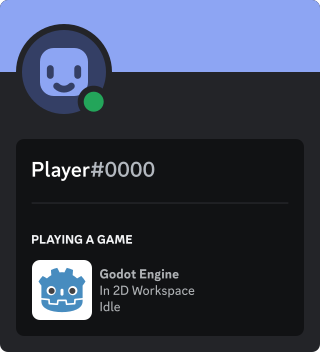

# Godot Discord RPC

This is a GDScript implementation of the deprecated [Discord RPC][discord-rpc]
for interfacing with the Discord client from your application. This tool is for
you if you don't need the full set of [Discord GameSDK][discord-game-sdk] features.

## Features
- Update Rich Presence status.
- Subscribe to Discord client's event.
- Non blocking RPC calls.

## Examples

Checkout more examples [here](examples/).  

### Rich Presence



A minimal Rich Presence example.

```gdscript
var discord := DiscordRPC.new()

# ...
# Establish a connection and wait for rpc_ready signal
# ...

await discord.update_presence({
  details = "In 2D workspace",
  state = "Idle",
  assets = {
    large_image = "icon"
  }
})
```

The same example but with a Rich Presence builder.

```gdscript
await discord.update_presence(
  RichPresenceBuilder.new()\
    .with_details("In 2D workspace")\
    .with_state("Idle")\
    .with_large_image("icon")\
    .build()
)
```

## Installation

### Release page

1. Download the latest release from the [release page][release-page].

2. Extract the zip file at the root directory of your project.

### Manual

1. clone this repository `git clone https://github.com/Abdera7mane/Discord-RPC-GDScript/`

2. Install the latest release of [godot-unix-socket][godot-unix-socket]

3. Make sure both addons are installed at the root directory of your project.

[discord-rpc]: https://github.com/discord/discord-rpc/
[discord-game-sdk]: https://discord.com/developers/docs/game-sdk/sdk-starter-guide 
[release-page]: https://github.com/Abdera7mane/Discord-RPC-GDScript/releases
[godot-unix-socket]: https://github.com/Abdera7mane/Godot-UnixSocket/
